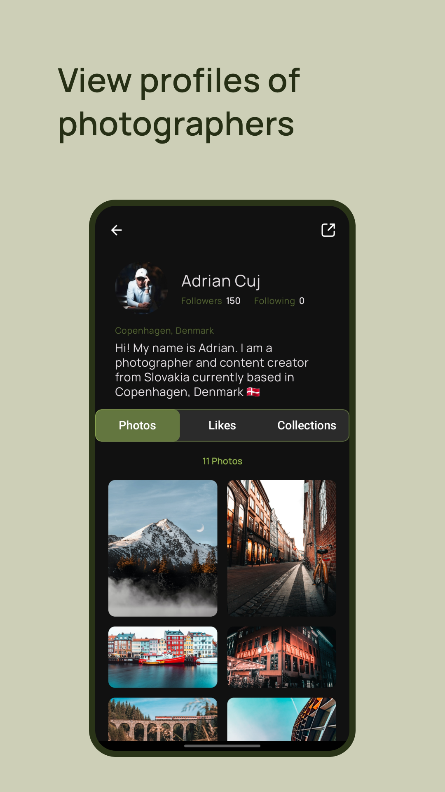
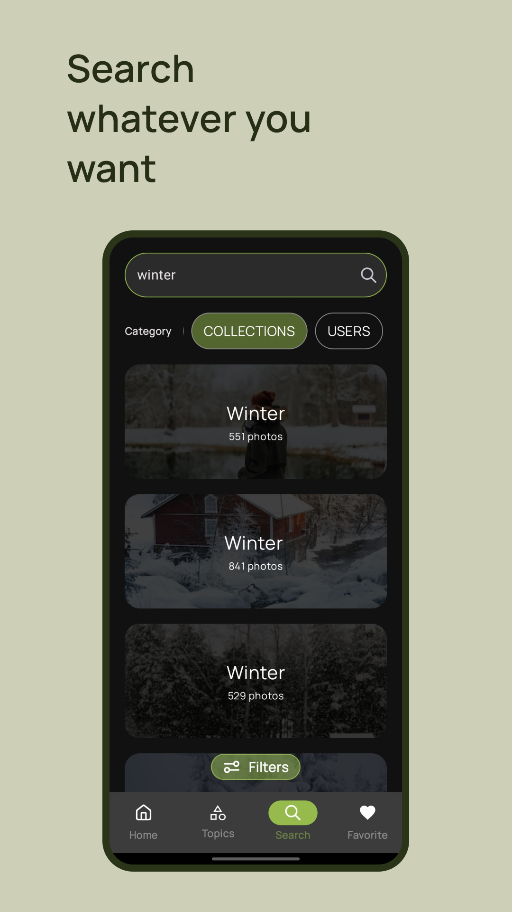
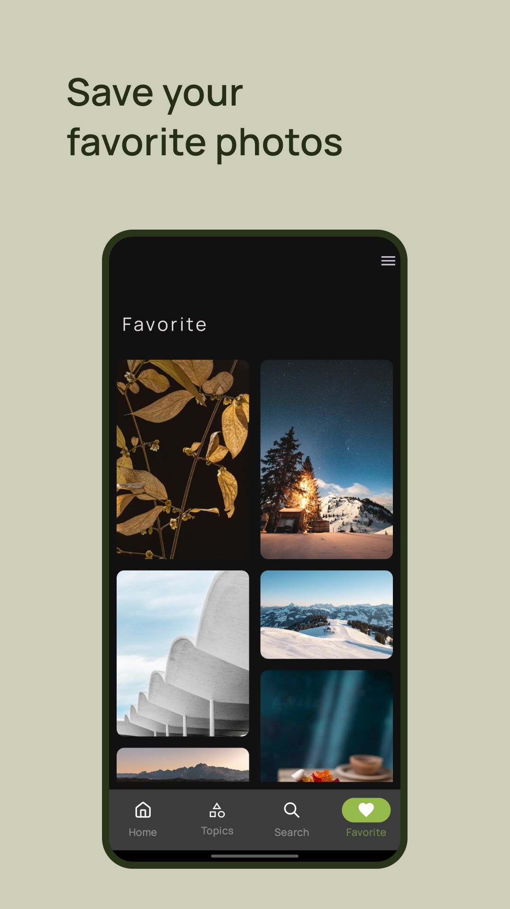

# Mysplash

Mysplash is unofficial [Unsplash](https://unsplash.com/) client for android,
allowing you to search for inspiration from over 3 million
carefully selected photos in high quality and
download them for free.

<a href="https://apps.rustore.ru/app/com.timurkhabibulin.mysplash"></a>

## Getting started

* Create a developer account at: https://unsplash.com/developers
* Copy your app access key
* Add the following to your `local.properties`:
```
unsplashAccessKey="Your access key"
storePassword=""
keyPassword=""
keyAlias=""
storeFile=""
```

To build the app, you need to get a `google-services.json` file from Firebase:

* Go to [Firebase](https://console.firebase.google.com) and create a new project
* In the Firebase console, add an Android app to the project with the package name `com.timurkhabibulin.mysplash`
* Download the `google-services.json` config file
* Then place the `google-services.json` file in the `app/` directory (at the root of the Android Studio app module)

## Technology Stack

* Kotlin
* Jetpack Compose
* Clean Architecture
* MVVM
* Coroutines
* Retrofit
* Room
* Pagination
* Hilt

## Screenshots

<p align="left">



</p>
<p align="left">


</p>


