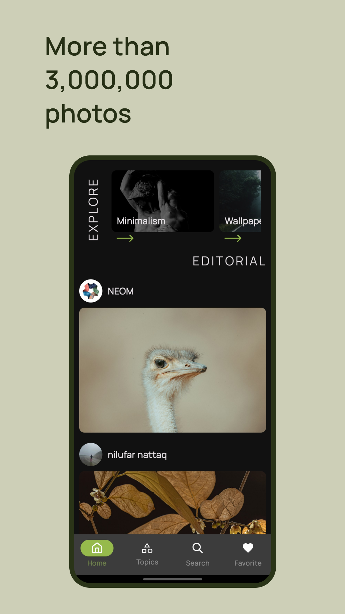
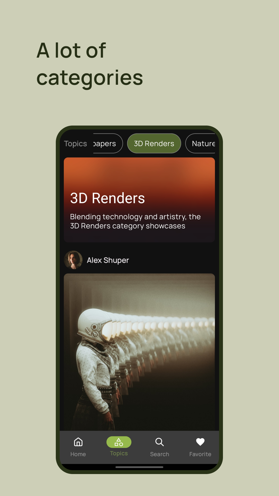
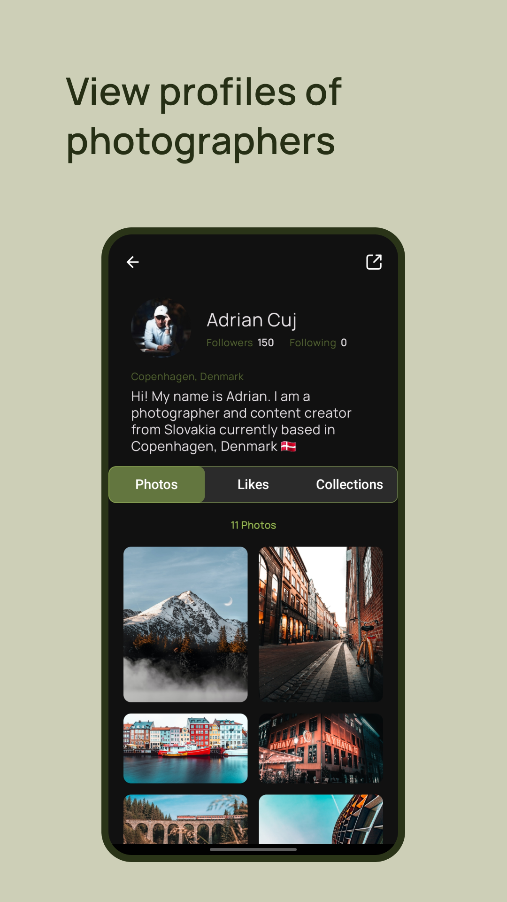
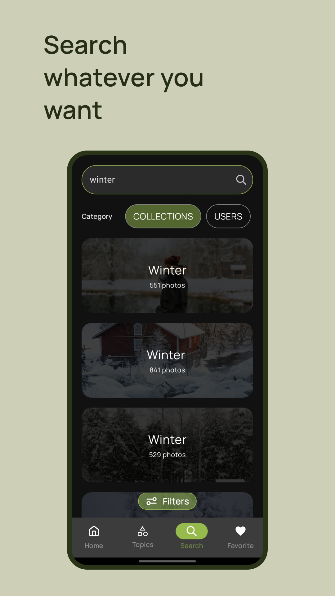
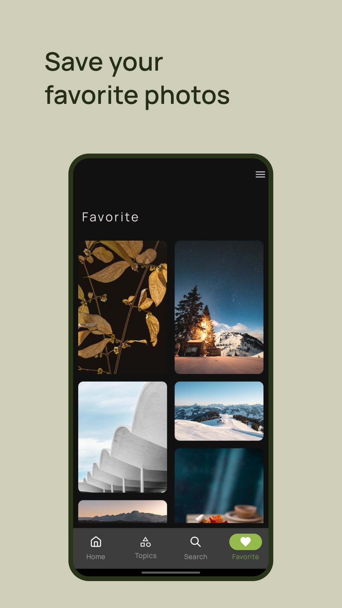

<div align="center">
<h1 align="center">Mysplash</h1>

</div>

<h4 align="center">Mysplash is unofficial Unsplash client for android,
allowing you to search for inspiration from over 3 million
carefully selected photos in high quality and
download them for free
</h4>

<p align="center">
  <br>
  <a href="https://apps.rustore.ru/app/com.timurkhabibulin.mysplash">
    
  </a>
  <br>
  <br>
  <a href="https://github.com/Timur-Khabibulin/Mysplash/releases/latest">
    
  </a>
  </a>
  </a>
  </a> 
</p>

<p align="center">





</p>

## Getting started

* Create a developer account at: https://unsplash.com/developers
* Copy your app access key
* Add the following to your `local.properties`:

```
unsplashAccessKey="Your access key"
storePassword=""
keyPassword=""
keyAlias=""
storeFile=""
```

To build the app, you need to get a `google-services.json` file from Firebase:

* Go to [Firebase](https://console.firebase.google.com) and create a new project
* In the Firebase console, add an Android app to the project with the package
  name `com.timurkhabibulin.mysplash`
* Download the `google-services.json` config file
* Then place the `google-services.json` file in the `app/` directory (at the root of the Android
  Studio app module)

## Technology Stack

* Kotlin
* Jetpack Compose
* Clean Architecture
* MVVM
* Coroutines
* Retrofit
* Room
* Pagination
* Hilt


