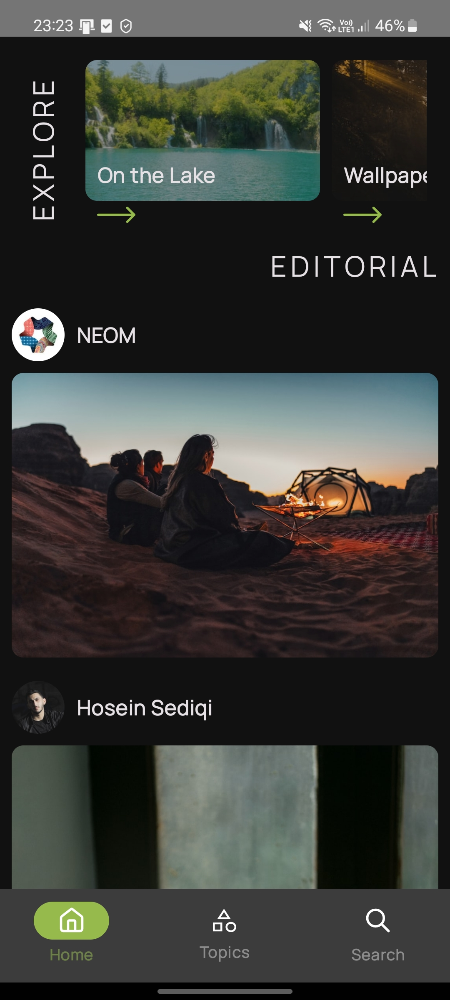
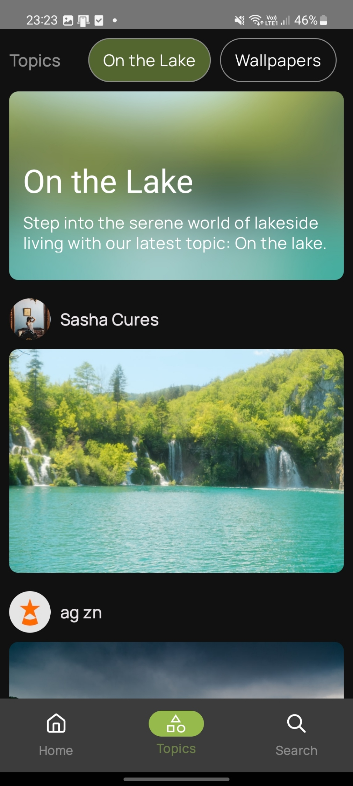
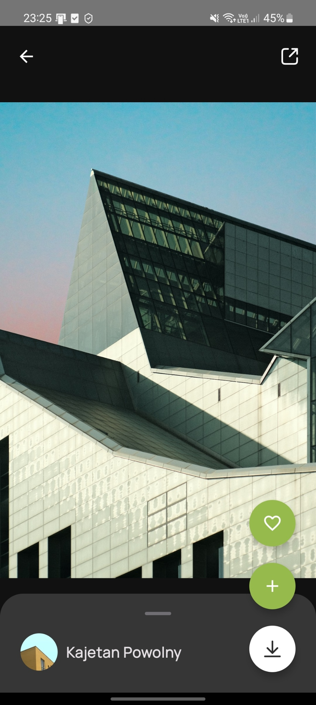
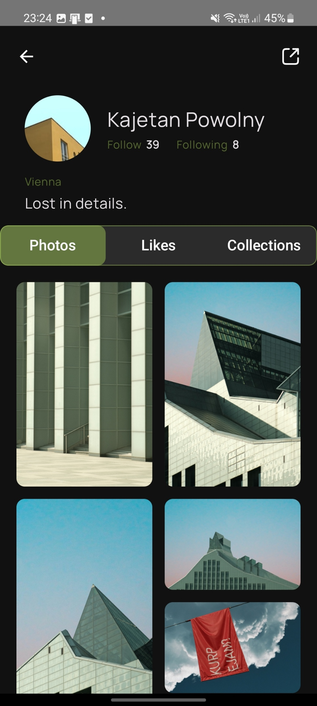
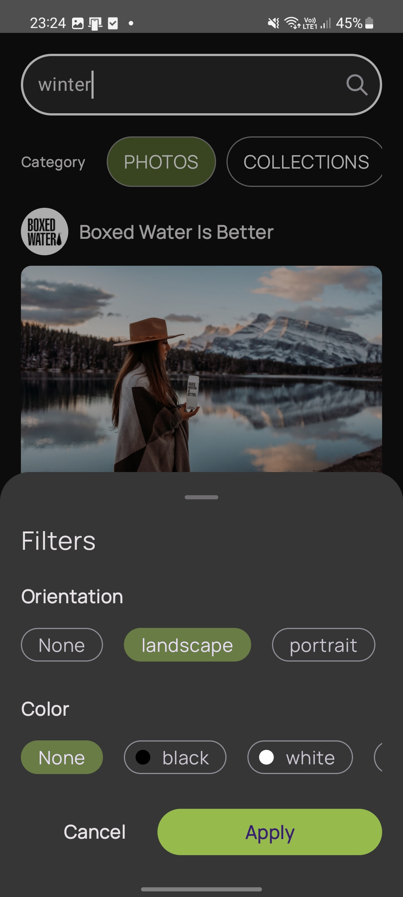
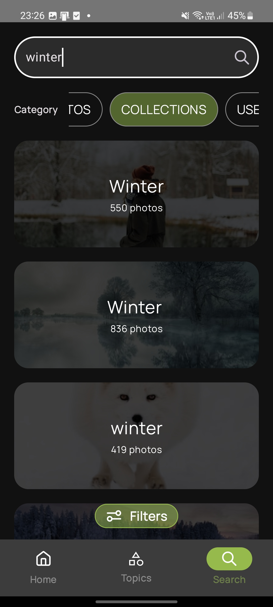
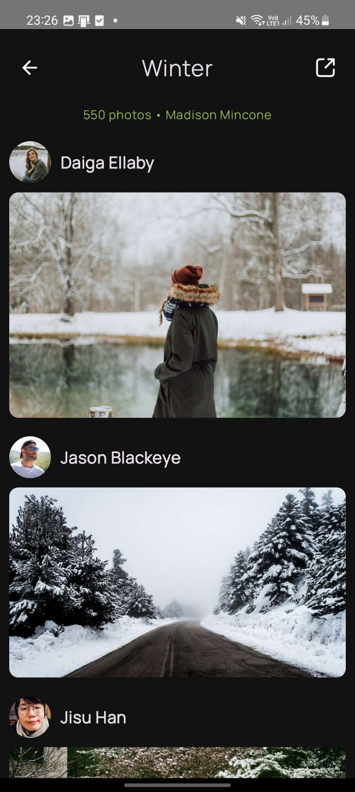

# Mysplash

Mysplash is unofficial [Unsplash](https://unsplash.com/) client for android,
allowing you to search for inspiration from over 3 million
carefully selected photos in high quality and
download them for free.

## Getting started

* Create a developer account at: https://unsplash.com/developers
* Copy your app access key
* Clone the repository and import it to Android Studio
* Add the following to your `local.properties`:
  `unsplashAccessKey="Your access key"`

## Screenshots

 

